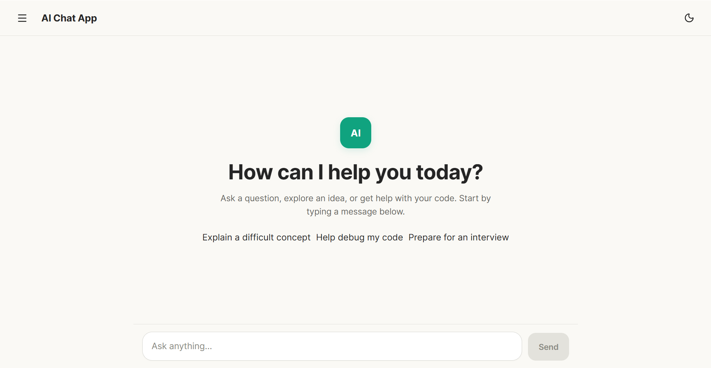
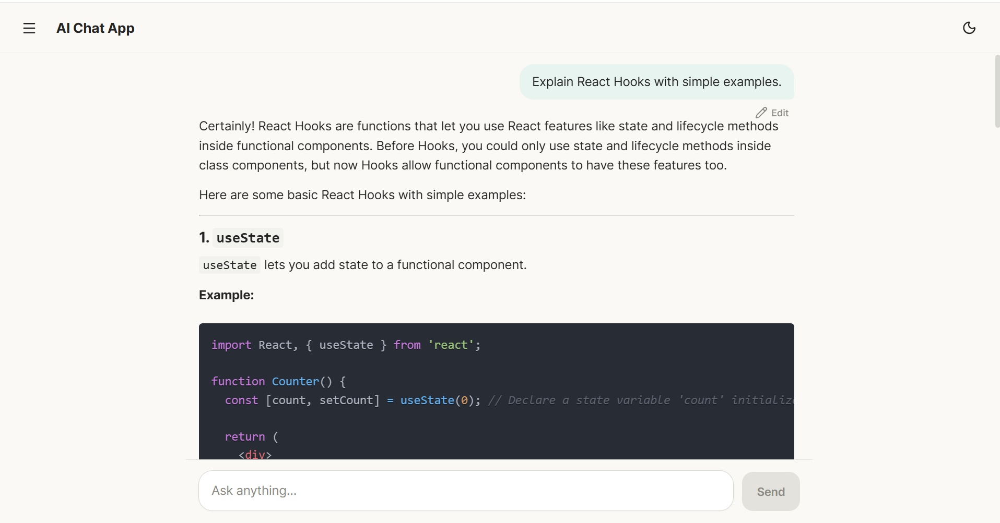
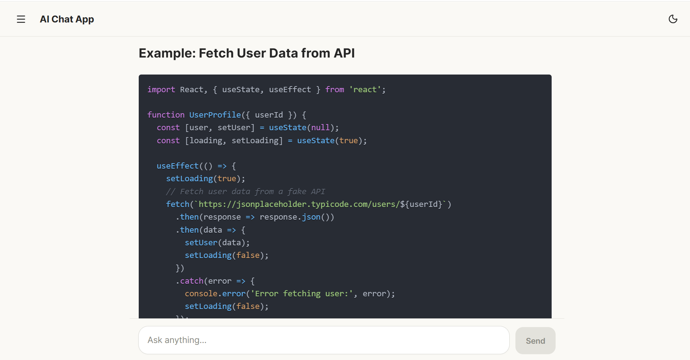
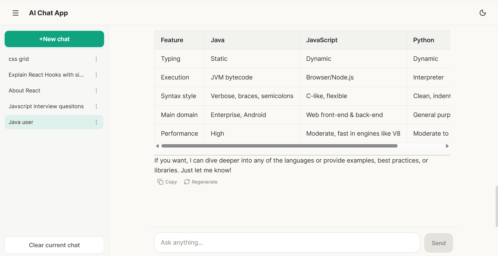
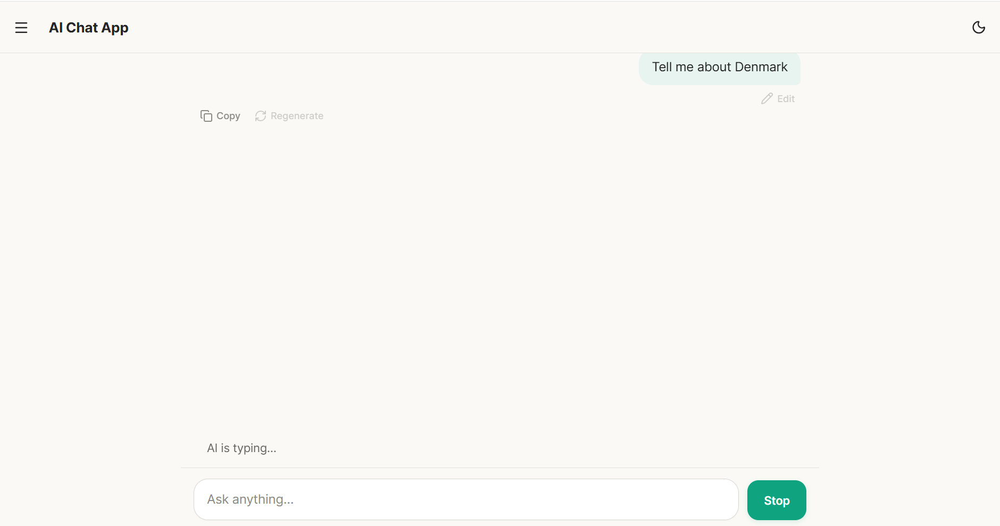
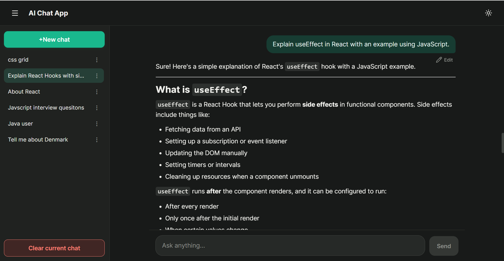

# 🤖 AI Chat App

A modern AI-powered chat application inspired by ChatGPT, built with React and Express. It supports multiple conversations, real-time AI responses, Markdown rendering, syntax-highlighted code blocks, streaming responses, dark mode, and responsive design.

## 🚀 Live Demo

🌐 https://ai-chat-app-fihe.vercel.app

## 📂 GitHub Repository

https://github.com/Ujjwal-Darnal/AI-Chat-App

---

# ✨ Features

- 💬 Multiple chat conversations
- 🤖 AI-powered responses using OpenAI
- ⚡ Streaming AI responses
- ✍️ Edit previously sent messages
- 📋 Copy AI responses
- 🔄 Regenerate AI responses
- ⏹️ Stop response generation
- 📝 Markdown rendering
- 💻 Syntax highlighting for code blocks
- 🌙 Dark / Light mode
- 📱 Fully responsive design
- 💾 Local Storage persistence
- 🗑️ Delete conversations
- ✏️ Rename conversations
- 🧹 Clear current chat
- 📜 Auto-scrolling messages
- 📐 Auto-resizing textarea
- ⚠️ Error handling
- ⏳ Loading states

---

# 🛠️ Tech Stack

### Frontend

- React
- JavaScript (ES6+)
- Vite
- CSS3
- React Markdown
- Remark GFM
- React Syntax Highlighter

### Backend

- Node.js
- Express.js
- OpenAI API

---

# 📸 Screenshots

## 🏠 Home Screen



---

## 💬 AI Conversation



---

## 📝 Markdown & Code Highlighting



---

## 📂 Chat History



---

## ⚡ Message Actions



---

## 🌙 Dark Mode



---

# ⚙️ Installation

## Clone the repository

```bash
git clone https://github.com/Ujjwal-Darnal/AI-Chat-App.git
```

## Navigate into the project

```bash
cd AI-Chat-App
```

## Install frontend dependencies

```bash
npm install
```

## Install backend dependencies

```bash
cd server
npm install
```

---

# 🔑 Environment Variables

## Backend (`server/.env`)

```env
OPENAI_API_KEY=your_api_key
PORT=5000
```

## Frontend (`.env`)

```env
VITE_API_BASE_URL=http://localhost:5000
```

For production:

```env
VITE_API_BASE_URL=https://your-render-url.onrender.com
```

---

# ▶️ Running Locally

## Start backend

```bash
cd server
npm run dev
```

## Start frontend

```bash
npm run dev
```

---

# 📁 Project Structure

```
AI-Chat-App
│
├── server/
│   ├── index.js
│   └── .env
│
├── src/
│   ├── components/
│   ├── services/
│   ├── styles/
│   └── App.jsx
│
├── public/
├── images/
└── README.md
```

---

# 🎯 Future Improvements

- User authentication
- Chat export
- Voice input
- Image generation
- File upload support
- AI model selection
- Conversation search
- PWA support

---

# 👨‍💻 Author

**Ujjwal Darnal**

GitHub:
https://github.com/Ujjwal-Darnal

LinkedIn:
https://www.linkedin.com/in/ujjwal-darnal-b23744331/

---

⭐ If you found this project useful, consider giving it a star!
